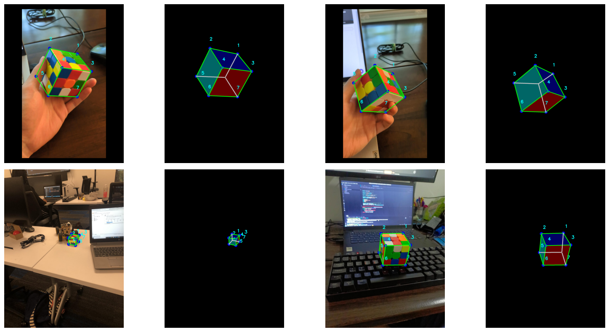

# 3D Cube Detection using CenterNet

## 🧊 Monocular 3D Object Detection

## 🎲 Keypoints-based 3D Reconstruction

[](https://www.python.org)
[](https://pytorch.org)


  

---

## 🧭 Dataset Overview

Total train images: 462 / Total val images: 70

✅ 7 corner points (transformed to 7 bounding boxes)

---

## 🏗️ Model Architecture

- 🧊 Model: **CenterNet**
- 🧊 Weight: **"ctdet_coco_dla_2x.pth"**
- 🧊 Framework: **PyTorch + DCNv2**
- 🧊 Input Size: **512**
- 🧊 Trained Epochs: **50**

---

## 📊 Final Performance
```
 Average Precision  (AP) @[ IoU=0.50:0.95 | area=   all | maxDets=100 ] = 0.132
 Average Precision  (AP) @[ IoU=0.50      | area=   all | maxDets=100 ] = 0.300
 Average Precision  (AP) @[ IoU=0.75      | area=   all | maxDets=100 ] = 0.107
 Average Precision  (AP) @[ IoU=0.50:0.95 | area= small | maxDets=100 ] = 0.276
 Average Precision  (AP) @[ IoU=0.50:0.95 | area=medium | maxDets=100 ] = 0.266
 Average Precision  (AP) @[ IoU=0.50:0.95 | area= large | maxDets=100 ] = 0.073
 Average Recall     (AR) @[ IoU=0.50:0.95 | area=   all | maxDets=  1 ] = 0.182
 Average Recall     (AR) @[ IoU=0.50:0.95 | area=   all | maxDets= 10 ] = 0.275
 Average Recall     (AR) @[ IoU=0.50:0.95 | area=   all | maxDets=100 ] = 0.285
 Average Recall     (AR) @[ IoU=0.50:0.95 | area= small | maxDets=100 ] = 0.304
 Average Recall     (AR) @[ IoU=0.50:0.95 | area=medium | maxDets=100 ] = 0.456
 Average Recall     (AR) @[ IoU=0.50:0.95 | area= large | maxDets=100 ] = 0.214
```

---

## 🔑 Summary
  
✅ Implemented minimally for model  
✅ **Note** Not bad bbox results.  
✅ Applied intensive post-processing

---

## ⭐ Acknowledgements

- CenterNet powered by `DCNv2`
- Dataset by Roboflow

---
